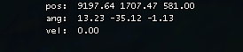

# Speedrun Tools for Portal 1 and Portal 2

BunnyMod + UGC spam fix for Portal 2.
Accurate `cl_showpos 1` velo for Portal 1 and Portal 2 (excludes vertical axis).

### cl_showpos 1 velo (For Portal 1 and Portal 2)

Usually the little velo label includes your forwards, sideways and vertical speed combined.
E.g. if you stand in place and jump, it will show your vertical speed.
This mod removes that part of the calculation, so it's only measuring your ground speed.

It just changes the what the label says, and doesn't affect gameplay in any way.

### BunnyMod for Portal 2

Normally Portal 2 will limit your ability to turn at high speed to almost nothing.
This removes that restriction allowing you to bunnyhop around corners and stuff.

It's totally cheating, but it's tons of fun.

### UGC spam for Portal 2

Removes some UGC warnings from the workshop which negatively affect your framerate.
Great on older machines, but also removes the odd hiccup.

## How use tho?

1:
Use the AutoAssemble script.

or

2:
Install cheat engine 6.something, load the table while the game is running.
Toggle the checkbox on the script.

## Warning!
These mods are applied to the game *while it's running*, in memory - no permanent change is made to your game on disk.
Next time you start the game, it will be back to normal.

Single player use will not result in VAC bans (ever ever ever), but use in coop/online games might.

And as always, standard disclaimer, if anything goes wrong, it's your fault not mine. 
Don't use them if you can't accept that.

